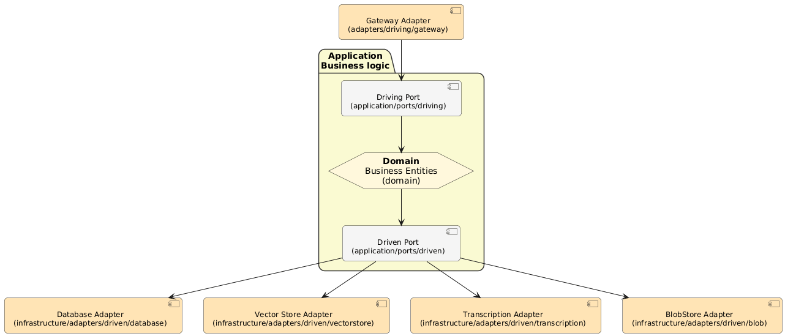

# LinguaPipe (still in development)

**A modular, production-ready Scala pipeline for transforming audio, text, and PDFs into searchable knowledge.**

LinguaPipe is designed with **Hexagonal Architecture** principles, making it easy to swap implementations without touching business logic. Built with **ZIO** for type-safe concurrency and **Scala 3** for modern functional programming.

## Features

- Transcribe audio with Whisper (faster-whisper Docker)
- Generate embeddings with HuggingFace Text Embeddings Inference (Docker)
- Store data in PostgreSQL
- Index vectors in Qdrant (Docker)
- Store blobs with MinIO (S3-compatible Docker service)
- Expose APIs via gRPC
- Switch adapters through config files without changing code
- Built with hexagonal architecture for clean testing and extension

## Roadmap

- [x] Implement REST Gateway
- [x] Implement a Transcriber Adapter
- [x] Allow audio ingestion
- [x] Implement a Database Adapter
- [ ] Implement an Embedder Adapter
- [ ] Implement a Vector Store Adapter
- [ ] Implement a Blob Store Adapter
- [ ] Allow text and PDF ingestion
- [ ] Implement gRPC Gateway
- [x] Implement Retry and Timeout Services

## 📋 Prerequisites

- **JDK 21+**
- **sbt 1.10+**
- **Docker & Docker Compose**

Note : No API keys or third-party accounts needed for the default configuration!

## 🚀 Quick Start

### 1. Clone the repository

```bash
git clone https://github.com/CyrilDesch/linguapipe.git
cd linguapipe
```

### 2. Start all services with Docker Compose

```bash
# Start all open-source dependencies
docker-compose up -d
```

This starts the following Docker containers:

- **PostgreSQL** (database) on `localhost:5432`
- **Qdrant** (vector store) on `localhost:6333`
- **Whisper** (transcription with faster-whisper) on `localhost:9001`
- **Text Embeddings Inference** (HuggingFace embeddings) on `localhost:8080`
- **MinIO** (S3-compatible storage) on `localhost:9000`

All services are ready to use with **no configuration needed**. The default `application.conf` is pre-configured to use these services.

### 3. Compile the project

```bash
sbt compile
```

### 4. Run the application

```bash
sbt "linguapipe-infrastructure/run"
```

## 🎯 Usage

### Running the application

```bash
# Standard run (make sure Docker services are running first)
sbt "linguapipe-infrastructure/run"

# Hot reload on code changes (development)
sbt "~linguapipe-infrastructure/reStart"

# Test the application
sbt test
```

## 🏗️ Architecture

LinguaPipe follows **Hexagonal Architecture** (Ports & Adapters) with three distinct modules:



### `linguapipe-domain`

**Pure business logic** with zero external dependencies.

### `linguapipe-application`

**Use cases and port definitions** orchestrating business workflows.

### `linguapipe-infrastructure`

**Concrete implementations** of all adapters and runtime concerns.

## ⚙️ Configuration

LinguaPipe uses **declarative configuration** through `application.conf`. Change adapters without modifying code!

### Example: Switching Database

```hocon
# PostgreSQL configuration (default)
linguapipe.adapters.driven.database {
  type = "postgres"
  postgres {
    host = "localhost"
    port = 5432
    database = "linguapipe"
    user = "linguapipe"
    password = "linguapipe"
  }
}
```

### Available Adapter Types

| Component        | Implementation | Default (Docker) |
| ---------------- | -------------- | ---------------- |
| **Database**     | PostgreSQL     | PostgreSQL       |
| **Vector Store** | Qdrant         | Qdrant           |
| **Transcriber**  | Whisper        | Whisper          |
| **Embedder**     | HuggingFace    | HuggingFace      |
| **Blob Store**   | MinIO          | MinIO            |
| **API Gateway**  | gRPC           | gRPC             |

## Environment Variables

The default configuration requires **no environment variables**. For production, you can override settings:

```bash
# Optional: Override database password
export DB_PASSWORD=secret123

# Optional: Override service URLs
export QDRANT_URL=http://your-qdrant:6333
export WHISPER_URL=http://your-whisper:9001
export HUGGINGFACE_URL=http://your-embeddings:8080
export MINIO_ENDPOINT=http://your-minio:9000

sbt "linguapipe-infrastructure/run"
```

Reference them in `application.conf`:

```hocon
linguapipe.adapters.driven.database {
  postgres {
    password = ${?DB_PASSWORD}  # Optional override
    host = ${?DB_HOST}          # Optional override
  }
}
```

## Extending LinguaPipe

### Adding a Driven Adapter

To add a new driven adapter (e.g., Redis, MongoDB, etc.):

1. Define the port interface in `linguapipe-application/***/ports/driven/` (if it doesn't exist)
2. Add config types in `RuntimeConfig.scala`
3. Implement the adapter in `linguapipe-infrastructure/***/adapters/driven/[type]/[tech]/`
4. Add factory case in `AdapterFactory.scala`
5. Add parser logic in `ConfigLoader.scala`
6. Document it in `application.conf`
7. (Optional) Add Docker service to `docker-compose.yml`

### Adding a Driving Adapter

To add a new driving adapter (e.g., WebSocket, CLI, etc.):

1. Define the driving port in `linguapipe-application/***/ports/driving/`
2. Add config types in `RuntimeConfig.scala`
3. Implement the adapter in `linguapipe-infrastructure/***/adapters/driving/[tech]/`
4. Wire it in the runtime module with ZIO layers
5. Update `application.conf` with the new adapter configuration

### Development Workflow

1. Model domain entities in `linguapipe-domain`
2. Define ports in `linguapipe-application/***/ports`
3. Implement use cases in `linguapipe-application/***/usecase`
4. Create adapters in `linguapipe-infrastructure/***/adapters`
5. Wire everything in `linguapipe-infrastructure/***/runtime`
6. Configure in `application.conf`

## 🧪 Testing

```bash
# Run all tests
sbt test

# Run tests for a specific module
sbt linguapipe-domain/test
sbt linguapipe-application/test
sbt linguapipe-infrastructure/test

# Run tests with coverage
sbt coverage test coverageReport
```

## 📚 Documentation

- **Architecture**: Hexagonal architecture principles and module structure (see Architecture section above)
- **Configuration**: Declarative adapter configuration system (see Configuration section above)
- **Cursor Rules**: `.cursor/rules/` - AI-assisted development guidelines

## 🤝 Contributing

We welcome contributions! This is an open-source project following strict architectural principles.

### Guidelines

- ✅ Follow hexagonal architecture boundaries
- ✅ Keep domain module pure (no external dependencies)
- ✅ Add tests for new features
- ✅ Fix all compiler and linter warnings
- ✅ Update configuration documentation when adding adapters
- ✅ Write clear commit messages

### Code Quality Standards

- Zero compiler warnings
- Zero linter warnings
- Explicit type signatures for all public APIs
- Immutable domain types
- Typed errors (no raw exceptions)
- HOCON configuration with type-safe parsing

## 📄 License

[GNU General Public License v3.0](LICENSE)

## 🙏 Acknowledgments

Built with:

- [Scala 3](https://www.scala-lang.org/) - Modern functional programming
- [ZIO](https://zio.dev/) - Type-safe, composable concurrency
- [gRPC](https://grpc.io/) - High-performance RPC framework
